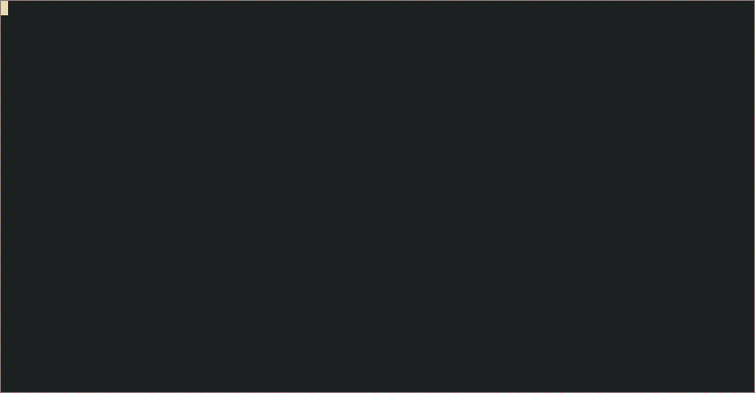

# Projectline
[](https://github.com/tterb/atomic-design-ui/blob/master/LICENSEs)

A program to set the environment for a project.
When you execute `projectline`, it looks for your projects inside a folder that you specify, then you can choose your project using `fzf` and then a set of functions defined by you are executed (More in [configuration](#configuration))

## Demo


## Dependencies
- [fd](https://github.com/sharkdp/fd)
- [fzf](https://github.com/junegunn/fzf)
- [tmux](https://github.com/tmux/tmux)
- git

The git dependencie is because it reads inside your projects folder looking for folders with .git inside

## Installation

To install projectline you can use this command:
```bash
make install
```

And if you want to install the default config file, you can use this
```bash
make config
```

# Configuration
`projectline` reads a config file in `~/.config/projectline/config.sh`. Here you can find the variable `projects_path` there you set the folder where `projectline` will look for your projects and you will find two functions: `before()` and `after()` where you have to put the commands you want to execute when you choose one project.

The reason to have `before()` and `after()` is because I want to add hooks for specific languages and tools in the future and those hooks will be executed between `before()` and `after()`.

This is the default example of `config.sh` with comments to show how it works:
```bash
projects_path=~/projects # This is the folder where projectline will look for your projects

function before(){ 
    tmux new -d -s $project_name -n editor # Opens tmux with the first window named as editor
    tmux send-keys -t "$project_name:0.0" 'nvim' Enter # Opens neovim in the editor window
    
    # Creates a new window with the name terminal, creates a division and returns to window 0
    tmux new-window -t $project_name -n terminal
    tmux splitw -h # 
    tmux select-window -t $session:0
}

function after(){
    tmux a -t $project_name # Connects to the tmux session
}
```

## TODO
- [ ] Add Hooks for specific languages and tools (Rust, Node, React, Python, Go, etc.)
- [ ] Add a `projectsfile.json` to store project paths, custom hooks for each project
- [ ] Migration to Rust to make faster searchs and parse json easily
- [ ] Add a way to switch between `projectsfile.json` and standard search

## Authors

- [@jmvalenciz](https://www.github.com/jmvalenciz)
